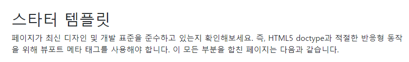
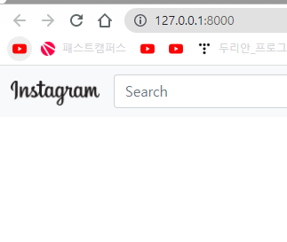
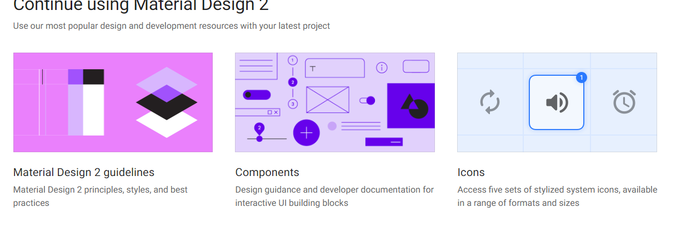
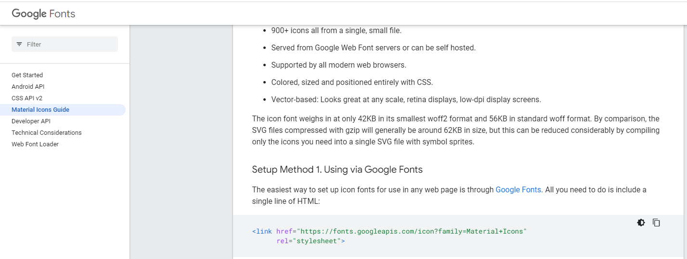
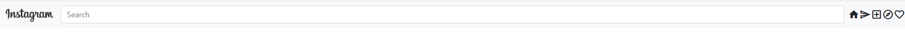
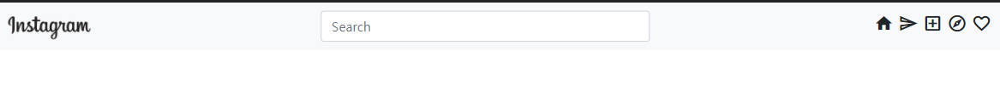
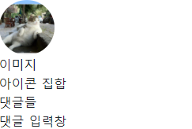

# Django Study 
## 0301 
###  장고의 특징
Python을 프로젝트를 만드때 가상환경을 만들고 내가 필요한 패키지를 설치하고 다른 가상환경과 독립적으로 운영이 가능하다. 

프로젝트를 만들때 [Virtualenv]라는 것을 사용한다. - Vscode에서 할시에도 설치 해야 하고 [venv]라고 명한다. 

프로젝트 생성시 프로젝트를 Location를 정해 주면 그 위에 venv 가상환경 폴더가 만들어서 그 위에 파이썬 버전에 따른 셋팅이 설정 된다.

장고는 MVT 구조이다 .
Model
View - 컨트롤러 역할 (데이터 처리)
Template - 화면 보이는 역할  (HTML, CSS 같은것)

manage.py - 장고를 관리는 역할 

urls.py - 장고에서 브라우저의 흐름은 
views.py - 를 만들고 drf Django-Rest-Framework를 만들어 줘야 한다. (설치) ( Rest를 지원 - 찾아보기)

### drf Django-Rest-Framework install

> pip install djangorestframework

#### 오류 해결
- drf Django-Rest-Framework를 설치 하려고 콘솔에 들어 갔는데 (venv) 즉 가상환경 위에 있어야 하는데 없으면 가상환경으로 들어가야 한다. 
- cd venv -> cd Scripts 하고 activate.bat를 입력 
- 보통은 이렇게 하면 되지만 
- uggestion [3,General]: activate.bat 명령이 현재 위치에 있지만 이 명령을 찾을 수 없습니다. Windows PowerShell은 기본적으로 현재 위치에서 명령을 로드하지 않습니다. 이 명령을 신뢰하는 경우 대신 ".\activate.bat"을(를) 입력하십시오. 자 세한 내용은 "get-help about_Command_Precedence"를 참조하십시오.
- 이런 오류가 발생 하면 .\activate를 입력 

## 0302

폴더 생성 - Root 폴더에서 python manage.py startapp [폴더이름]

앱단위로 하는 이유 : 여러 소스 파일을 분할해서 관리 ( 댓글, 게시물, 좋아요 관련 이런것 )

탬플릿도 탬플릿 안에 앱 이름으로 구분을 하고 그안에 HTML을 넣는게 일반적인 장고 (화면)

## 0306

Settings에 추가한 앱들 추가 하면 장고가 추가한거 인지<br/>
<br/>
이유 : model을 나중에 DB로 마이그래이션 할때 INSTALLED_APPS에 목록이 없으면 자동으로 마이그래이션 못함

부트 스트랩  : https://getbootstrap.kr/

1) 시작 하기 클릭 
2) 스타터 템플릿 -> 부트스트랩 시작하기 위한 소스들을 모아 둔것

3) 스타터 탬플릿 추가 ( Main.html )
```html
<!doctype html>
<html lang="en">
  <head>
    <!-- Required meta tags -->
    <meta charset="utf-8">
    <meta name="viewport" content="width=device-width, initial-scale=1">

    <!-- Bootstrap CSS -->
    <link href="https://cdn.jsdelivr.net/npm/bootstrap@5.1.3/dist/css/bootstrap.min.css" rel="stylesheet" integrity="sha384-1BmE4kWBq78iYhFldvKuhfTAU6auU8tT94WrHftjDbrCEXSU1oBoqyl2QvZ6jIW3" crossorigin="anonymous">

    <title>Hello, world!</title>
  </head>
  <body>
    <h1>Hello, world!</h1>

    <!-- Optional JavaScript; choose one of the two! -->

    <!-- Option 1: Bootstrap Bundle with Popper -->
    <script src="https://cdn.jsdelivr.net/npm/bootstrap@5.1.3/dist/js/bootstrap.bundle.min.js" integrity="sha384-ka7Sk0Gln4gmtz2MlQnikT1wXgYsOg+OMhuP+IlRH9sENBO0LRn5q+8nbTov4+1p" crossorigin="anonymous"></script>

    <!-- Option 2: Separate Popper and Bootstrap JS -->
    <!--
    <script src="https://cdn.jsdelivr.net/npm/@popperjs/core@2.10.2/dist/umd/popper.min.js" integrity="sha384-7+zCNj/IqJ95wo16oMtfsKbZ9ccEh31eOz1HGyDuCQ6wgnyJNSYdrPa03rtR1zdB" crossorigin="anonymous"></script>
    <script src="https://cdn.jsdelivr.net/npm/bootstrap@5.1.3/dist/js/bootstrap.min.js" integrity="sha384-QJHtvGhmr9XOIpI6YVutG+2QOK9T+ZnN4kzFN1RtK3zEFEIsxhlmWl5/YESvpZ13" crossorigin="anonymous"></script>
    -->
  </body>
</html>
```
4)navbar 추가

```html
<body>
    <h1></h1>
    nav바 복사한것을 추가 하기
</body>

```

5) nav 수정(1) - 인스타 로고와 검색창만 남기기 
```html
<nav class="navbar navbar-expand-lg navbar-light bg-light">
    <div class="container-fluid">
        <a class="navbar-brand" href="#"> 
        </a>
            <input class="form-control me-2" type="search" placeholder="Search" aria-label="Search">
    </div>
    </div>
</nav>
```


## 0307
### 아이콘 추가
1) URL 
Google meterial icon 
URL : https://material.io/design/iconography/system-icons.html#design-principles


2) ICON 찾기 
URL : https://fonts.google.com/icons

3) Google Icon install 
구글 아이콘을 사용하기 위해서는 HTML의 Header 부분에 하기의 코드를 추가 해야 한다.

```html
<link
    href="https://fonts.googleapis.com/css?family=Material+Icons|Material+Icons+Outlined|Material+Icons+Two+Tone|Material+Icons+Round|Material+Icons+Sharp"
    rel="stylesheet">

```
코드가 있는 사이트도 하기에 정리 (수정 필요) <br/>

URL : https://developers.google.com/fonts/docs/material_icons


아이콘 추가 결과

```html
<nav class="navbar navbar-expand-lg navbar-light bg-light">
    <div class="container-fluid">
        <a class="navbar-brand" href="#"> 
        </a>
        <input class="form-control me-2" type="search" placeholder="Search" aria-label="Search">
        <span class="material-icons">home</span>
        <span class="material-icons-outlined">send</span>
        <span class="material-icons-outlined">add_box</span>
        <span class="material-icons-outlined">explore</span>
        <span class="material-icons-outlined">favorite_border</span>
    </div>
    </div>
</nav>
```
검색창과 아이콘 location 수정 
먼저 아이콘를 하나의 Div로 묶는 과정을 진행 하였다. 이렇게 하여 로고, 검색창, 로고로 헤더를 나누게 되었다. <br/>
다음으로는 검색창의 width를 400px로 수정하여 사이즈를 수정 하였다. <br/>
마지막으로 nav의 크기를 1000px으로 제한 및 justify-content: space-between로 맨 왼쪽은 [로고] 중앙에 [검색] 맨 오른쪽은 [아이콘]을 위치 시켯다.
하기에 사진 및 코드를 입력 하겠다. 

```html
<nav class="navbar navbar-expand-lg navbar-light bg-light">
    <div class="container-fluid" style="justify-content: space-between; flex-wrap : nowrap; min-width: 1000px" >
        <a class="navbar-brand" href="#"> 
        </a>
        <input class="form-control me-2" type="search" placeholder="Search" aria-label="Search" style="width: 400px;">

        <div>
            <span class="material-icons">home</span>
            <span class="material-icons-outlined">send</span>
            <span class="material-icons-outlined">add_box</span>
            <span class="material-icons-outlined">explore</span>
            <span class="material-icons-outlined">favorite_border</span>
        </div>
    </div>
</nav>
```
## 0324
### 이미지 동그랗게 만들기
```
 <style>
        .box {
            width: 70px;
            height: 70px;
            border-radius: 70%;
            overflow: hidden;
        }
        .profile {
            width: 100%;
            height: 100%;
            object-fit: cover;
        }
</style>  
```
```html
  {# 이미지 동그랗게 #}
            <div>
                <div class="box" >
                    
                </div>
            </div>
```
> 결과 
> 